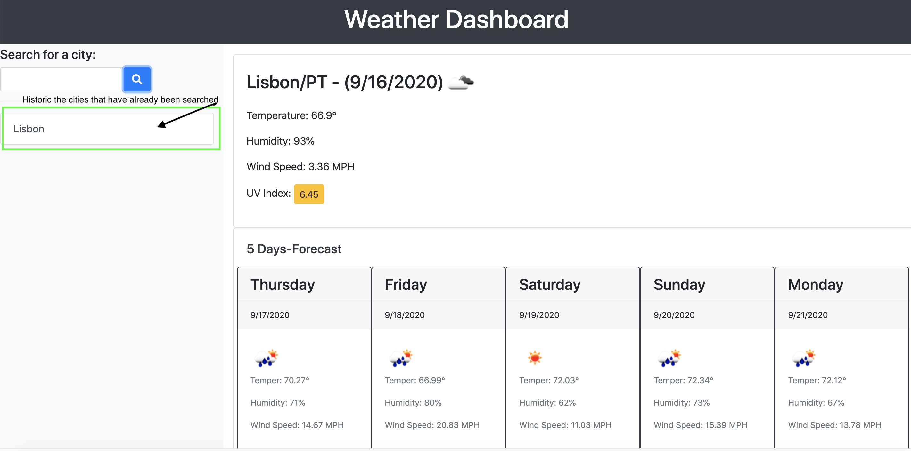

# Weather-Dashboard
A web page with the objective shows the weather of the current day and another 5 days ahead.

Weather dashboard with form inputs that you search for a city.
THEN I will be presented with current and future conditions for that city and that city is added to the search history

* city name, 
* the date, 
* an icon representation of weather conditions, 
* the temperature, 
* the humidity, 
* the wind speed, 
* the UV index: a color that indicates whether the conditions are favorable, moderate, or severe

Future weather conditions for that city
with a 5-day forecast that displays 
* the date, 
* an icon representation of weather conditions, 
* the temperature, 
* and the humidity

# Save your previous searches
You can click on a city in the search history and then display the current and future conditions of that city again.

## 📝 License

Copyright © 2020 [Adriana](https://github.com/adriana-carmo). 
[Homepage](https://adriana-carmo.github.io/Weather-Dashboard/)

